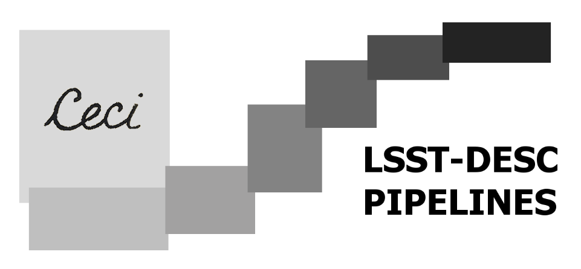

<h2 align="center">Ceci Pipeline Software</h2>

> “Ceci n'est pas une pipeline.”

A lightweight parsl-based framework for running DESC pipelines.

This is now beta status.

## This is a copy of teh official ceci package that is modified in order to launch pipelines defined by multiple documents yaml files
## LAPP 2025

